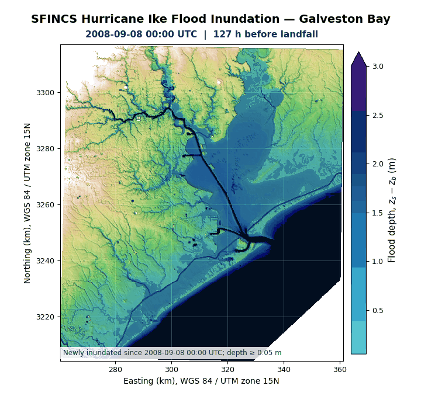

# Hurricane Ike: ERA5–MOM6–SFINCS workflow

**Author:** Faezeh Maghsoodifar, The University of Alabama

This repository documents a Gulf of Mexico regional-ocean and coastal-flooding
workflow for Hurricane Ike (2008). It combines ERA5 atmospheric forcing,
CrocoDash/CESM regional MOM6, SFINCS for Galveston Bay, NOAA observations, and
Copernicus DUACS sea-level data.

## Animated results

### SFINCS flood inundation



The SFINCS animation covers 2008-09-08 through 2008-09-16 and displays every
third hourly output, with the exact 2008-09-13 07:00 UTC landfall frame added.
Flood depth is shown only where an initially dry model cell subsequently has at
least 0.05 m of water. The reproducible generator is
[`create_sfincs_flood_animation.py`](ike-mom6-sfincs/scripts/create_sfincs_flood_animation.py).

### MOM6 and Copernicus sea level

The animation below was extracted from the project presentation so that it
plays directly on GitHub. The Copernicus product is daily, so the frame for
2008-09-13 represents the daily mean rather than Ike's exact landfall hour.


An additional MOM6 sea-surface-height animation is available
[here](ike-mom6-sfincs/figures/gom12_ike_ERA5full.001_ssh_ike.gif).

## Main project files

- [Project presentation](ike-mom6-sfincs/slides/Presentation.pptx) — download
  the PowerPoint to view all embedded slide media and animations.
- [Main ERA5–MOM6 notebook](ike-mom6-sfincs/notebooks/ike_era5_full_crocodash.ipynb)
- [MOM6 products for SFINCS notebook](ike-mom6-sfincs/notebooks/SFINCS_MOM6_ready_files.ipynb)
- [Complete SFINCS model archive](ike-mom6-sfincs/sfincs/archive/SFINCS_Model_Galveston_Ike_2008.zip)
  — 1.347 GiB, stored with Git LFS.
- [SFINCS archive notes and checksum](ike-mom6-sfincs/sfincs/archive/README.md)
- [Figures](ike-mom6-sfincs/figures) and
  [SFINCS evaluation products](ike-mom6-sfincs/sfincs/results)
- [Credits and citations](ike-mom6-sfincs/CREDITS_AND_CITATIONS.md), including
  special credit for AutoCF v1.0.0 HPC.

## Downloading the large SFINCS archive

Install Git LFS before cloning so the model ZIP is downloaded rather than only
its small pointer file:

```bash
git lfs install
git clone https://github.com/FaezehMagFar/crocodile2026.git
cd crocodile2026
git lfs pull
```

## Repository layout

- `ike-mom6-sfincs/` — curated notebooks, scripts, figures, presentation,
  SFINCS configuration/evaluation products, and the full model ZIP.
- `ERA5 CrocoDash bundle/` — the previously published ERA5 extension bundle.
- `install.sh` and `install.d/` — the original CROCODILE workspace installer.
- `docs/CROCODILE_WORKSPACE_TEMPLATE.md` — the original template guidance.

Large duplicate archives, software installers, recordings, temporary build
folders, the 7.3 GiB ERA5 working file, and unrelated workshop materials are
intentionally excluded.

## Credits and references

**Project author:** Faezeh Maghsoodifar, The University of Alabama.

Third-party names and references below acknowledge the software and data used
by this workflow and do not imply endorsement of this project.

### AutoCF

**AutoCF v1.0.0 HPC release** was used to automate the Galveston Bay SFINCS
model build, execute the GPU run, prepare forcing and terrain inputs, and
create evaluation and provenance products. AutoCF executables, compiled
modules, containers, and installers are not redistributed here. The available
release did not provide a public bibliographic citation, so it is identified as:

> AutoCF, version 1.0.0 HPC release (2026), computer software used for SFINCS
> model construction, execution, evaluation, and provenance generation.

### Modeling and workflow software

- **SFINCS (Deltares):** Leijnse, T., van Ormondt, M., Nederhoff, K., and van
  Dongeren, A. (2021). Modeling compound flooding in coastal systems using a
  computationally efficient reduced-physics solver. *Coastal Engineering,
  163*, 103796. [https://doi.org/10.1016/j.coastaleng.2020.103796](https://doi.org/10.1016/j.coastaleng.2020.103796)
- **HydroMT:** Eilander, D., et al. (2023). HydroMT: Automated and reproducible
  model building and analysis. *Journal of Open Source Software, 8*(83), 4897.
  [https://doi.org/10.21105/joss.04897](https://doi.org/10.21105/joss.04897)
- **HydroMT-SFINCS:** [Deltares HydroMT plugin for SFINCS](https://github.com/Deltares/hydromt_sfincs)
- **MOM6:** [NOAA-GFDL Modular Ocean Model 6](https://github.com/NOAA-GFDL/MOM6)
- **CrocoDash and CROCODILE:** [CrocoDash](https://github.com/CROCODILE-CESM/CrocoDash)
  and the [CROCODILE-CESM organization](https://github.com/CROCODILE-CESM).
  The official CrocoDash
  [`CITATION.cff`](https://github.com/CROCODILE-CESM/CrocoDash/blob/main/CITATION.cff)
  credits **Manish Venumuddula, Alper Altuntas, Mike Levy, Aidan Janney,
  Andrew Kwong, and Nguyen Hung**.
- **CESM/CIME and CDEPS:** [Community Earth System Model infrastructure](https://github.com/ESCOMP/CESM)
- **Python tools:** Jupyter, xarray, NumPy, pandas, SciPy, Matplotlib, Cartopy,
  netCDF4, cftime, Pillow, and the Copernicus Marine Toolbox.

### Atmospheric, ocean, terrain, and land-surface data

- **ERA5:** Hersbach, H., et al. (2020). The ERA5 global reanalysis.
  *Quarterly Journal of the Royal Meteorological Society, 146*(730), 1999–2049.
  [Article](https://doi.org/10.1002/qj.3803) and
  [hourly single-level data](https://doi.org/10.24381/cds.adbb2d47)
- **Copernicus DUACS sea level:** *Global Ocean Gridded L4 Sea Surface Heights
  and Derived Variables Reprocessed Copernicus Climate Service*, product
  `SEALEVEL_GLO_PHY_CLIMATE_L4_MY_008_057`, dataset
  `c3s_obs-sl_glo_phy-ssh_my_twosat-l4-duacs-0.25deg_P1D`.
  [Product reference](https://doi.org/10.48670/moi-00145)
- **NOAA Analysis of Record for Calibration (AORC) v1.1:** Fall, G., et al.
  (2023). [Dataset description and precipitation evaluation](https://doi.org/10.1111/1752-1688.13143)
- **NOAA CO-OPS water levels:** Center for Operational Oceanographic Products
  and Services (2018), NOAA NCEI.
  [Dataset reference](https://doi.org/10.25921/dt9g-2p60)
- **NOAA CUDEM:** Amante, C. J., et al. (2023). Continuously Updated Digital
  Elevation Models to Support Coastal Inundation Modeling. *Remote Sensing,
  15*, 1702. [Article](https://doi.org/10.3390/rs15061702)
- **GEBCO 2024 Grid:** GEBCO Compilation Group (2024).
  [Dataset reference](https://doi.org/10.5285/1c44ce99-0a0d-5f4f-e063-7086abc0ea0f)
- **ESA WorldCover 2021 v200:** Zanaga, D., et al. (2022).
  [Dataset reference](https://doi.org/10.5281/zenodo.7254221). Map attribution:
  © ESA WorldCover project 2021 / Contains modified Copernicus Sentinel data
  (2021) processed by the ESA WorldCover consortium.
- **GCN250:** Jaafar, H. H., and Ahmad, F. A. (2019), global curve-number data.
  [Article](https://doi.org/10.1038/s41597-019-0155-x) and
  [dataset](https://doi.org/10.6084/m9.figshare.7756202.v1)
- **USGS streamflow:** U.S. Geological Survey National Water Information
  System/API data. [USGS Water Data](https://waterdata.usgs.gov/)

The notebooks also use or reference GLORYS ocean reanalysis, TPXO tides, NOAA
CORA, and GEBCO bathymetry supplied through NCAR/CrocoDash workflows. Exact
versions and access records should be retained when those products are reused.

Third-party datasets and software retain their own licenses and citation
requirements. The repository license does not replace those terms. A duplicate
copy of these acknowledgments is retained in
[CREDITS_AND_CITATIONS.md](ike-mom6-sfincs/CREDITS_AND_CITATIONS.md).
