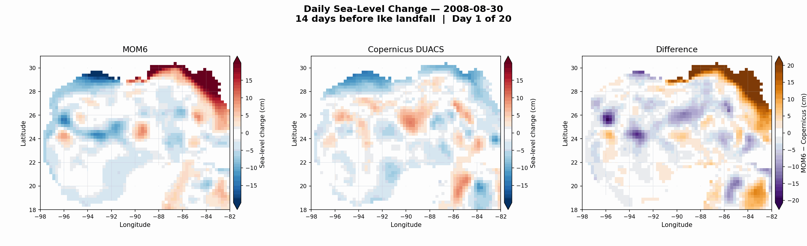
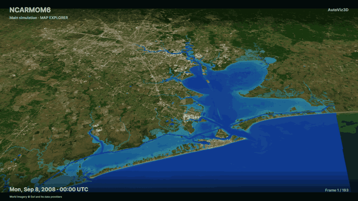

# Hurricane Ike MOM6–SFINCS project

**Author:** Faezeh Maghsoodifar, The University of Alabama

This directory contains the curated research materials for the Hurricane Ike
(2008) ERA5–regional MOM6–SFINCS workflow.

This work was developed as a participant project during the
[2026 CROCODILE + MOM6 Workshop](https://www.cesm.ucar.edu/events/2026/CROCODILE-Workshop)
at the NSF NCAR Mesa Laboratory in Boulder, Colorado.

## Results

### ERA5–MOM6 and Copernicus sea level

The comparison uses daily Copernicus DUACS fields. The 2008-09-13 frame is the
landfall-day mean, not an observation at the exact landfall hour.

### SFINCS flood propagation in AutoViz3D

The AutoViz3D Map Explorer animation uses the hourly `sfincs_map.nc` output and
covers 2008-09-08 through 2008-09-16. The GitHub preview retains every third
model output and displays each frame for 0.3 seconds so the progression remains
readable. Model timestamps are shown in UTC over Esri World Imagery. World
Imagery © Esri and its data providers.

Key outputs:

- [`Presentation.pptx`](../Presentation.pptx) — complete presentation with
  embedded media, stored at the repository root.
- `figures/` — static figures and GitHub-playable animations.
- `sfincs/results/` — compact evaluation figures, tables, and provenance.
- `sfincs/archive/SFINCS_Model_Galveston_Ike_2008.zip` — complete SFINCS model
  package, stored with Git LFS.

## Reproduce the workflow

1. Follow `notebooks/ERA5_CrocoDash_NCAR_setup_runbook.ipynb` on NCAR systems.
2. Run `notebooks/ike_era5_full_crocodash.ipynb` to configure and analyze the
   regional MOM6 experiment.
3. Use `notebooks/SFINCS_MOM6_ready_files.ipynb` to prepare the regional MOM6
   products for the SFINCS workflow.
4. See `docs/HANDOFF_SFINCS_AutoCF.md` and `docs/AUTOCF_COMMANDS.md` for the
   recorded AutoCF/SFINCS build, run, and evaluation process.

The notebooks retain NCAR and UAHPC paths from the recorded runs. Adapt paths,
project codes, and environments before execution.

## Contents

- `notebooks/` — model setup, sensitivity experiments, analysis, and SFINCS
  preparation.
- `scripts/` — supporting validation and comparison utilities.
- `docs/` — experiment design, investigation notes, and execution records.
- `figures/` — publication and presentation graphics.
- `../Presentation.pptx` — the final PowerPoint presentation at repository root.
- `sfincs/` — lightweight configuration/evaluation records plus the LFS model
  archive.

## Attribution and reuse

[AutoCF v1.0.0 HPC](https://autocf.net/) was used to build, run, and evaluate
the SFINCS case. The AutoCF software distribution is not included. See
`CREDITS_AND_CITATIONS.md` for the full citation and software/data
acknowledgments. Third-party datasets and software retain their original
licenses.
